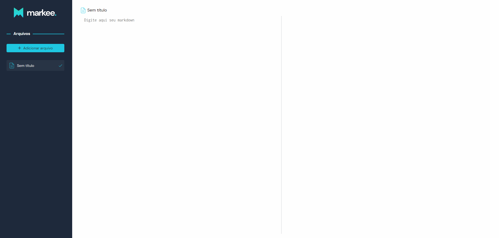

<div align="center">
  
</div>



---

## 🛠️ Technologies

- **[TypeScript](https://www.typescriptlang.org/)**
- **[React](https://pt-br.reactjs.org/)**
- **[Styled Components](https://styled-components.com/)**
- **[Marked](https://github.com/markedjs/marked)**
- **[Highlight.js](https://github.com/highlightjs/highlight.js)**
- **[ESLint](https://eslint.org/)**
- **[Husky](https://github.com/typicode/husky)**

## ⚙️ How to use

To clone and run this application, you'll need **[GIT](https://git-scm.com/)**, **[Node](https://nodejs.org/en/)** and **[Yarn](https://classic.yarnpkg.com/en/docs/install/)** installed on your computer. From your command line:

**Clone this repository**

```
git clone https://github.com/theandersonfonseca/markee-app.git
```

**Go into the repository**

```
cd markee-app
```

**Install dependencies**

```
yarn
```

**Run the app**

```
yarn dev
```

---

Made with ♥ by **[Anderson Fonseca](https://github.com/theandersonfonseca)**.
